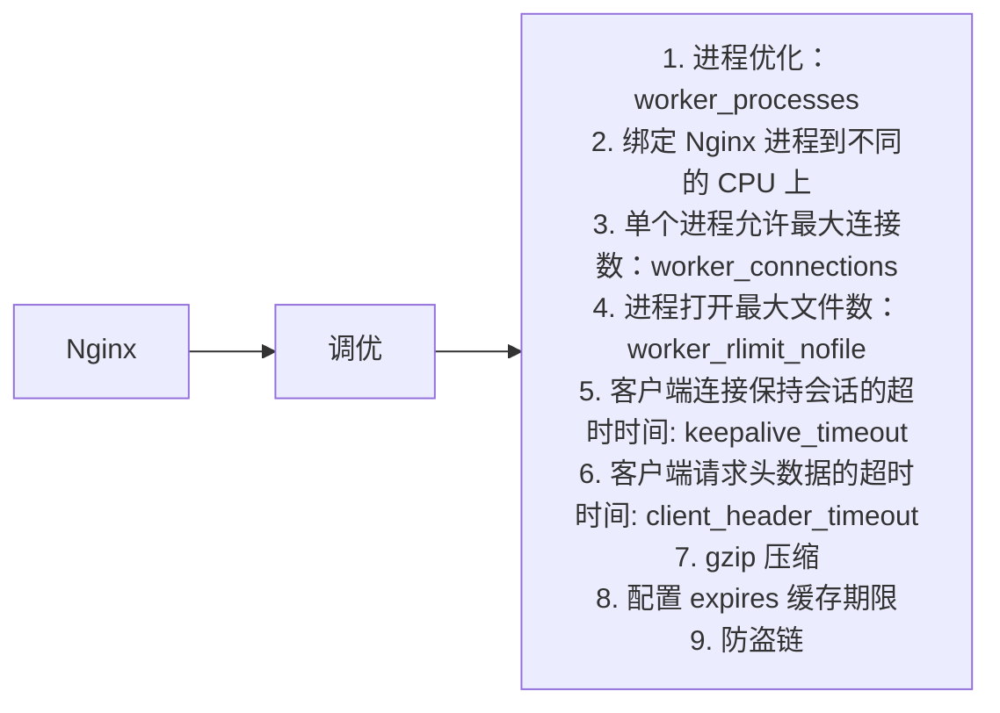

## 1.Prometheus 监控 nginx

- 网上关于 nginx 监控几乎全都需要增加 nginx-module-vts 模块，但是，一般情况下都是直接 apt /yum 安装的 nginx ，重新源码编译 nginx 不太现实！

- 初级阶段用不了那么复杂，如果希望高级一些，不如直接使用 openResty，然后，通过 LUA 支持模块进行 exporter

- 通过 ngx_http_stub_status_module 模块功能来输出 nginx_status

- 检查是否已经包含了 ngx_http_stub_status_module

```shell
$ nginx -V 2>&1 | grep -o with-http_stub_status_module
```

1.修改nginx配置文件

- 增加一个 location /nginx_status

```shell
$ vim nginx.conf
location /nginx_status {
    stub_status on;
}

$ nginx -s reload    # 重新加载配置文件
```

测试访问： http://x.x.x.x/nginx_status

2.下载安装 nginx-prometheus-exporter

https://github.com/nginxinc/nginx-prometheus-exporter/tags

```shell
$ wget https://github.com/nginxinc/nginx-prometheus-exporter/releases/download/v0.10.0/nginx-prometheus-exporter_0.10.0_linux_amd64.tar.gz
$ tar -xf nginx-prometheus-exporter_0.10.0_linux_amd64.tar.gz
$ ./nginx-prometheus-exporter -nginx.scrape-uri http://x.x.x.x/nginx_status
```

用systemct方式启动：

```shell
$ vim /etc/systemd/system/nginx_exporter.service

[Unit]
Description=nginx_prometheus_exporter
After=network.target

[Service]
Type=simple
ExecStart=/data/nginx-prometheus-exporter -nginx.scrape-uri http://x.x.x.x/nginx_status     #ip替换成需要监控的ip
Restart=on-failure

[Install]
WantedBy=multi-user.target
```

测试访问：http://x.x.x.x:9113/metrics

3.配置 Prometheus 

```yaml
  - job_name: "ali-2"
    static_configs:
      - targets: ["x.x.x.x:9113"]
```

添加告警规则：

```yaml
    - alert: "告警描述：Nginx is down"
      expr: nginx_up == 0
      for: 30s
      labels:
        severity: "告警等级: emergency"
      annotations:
        description: '告警问题：{{ $labels.instance }} Nginx 已停止运行'
        address: "告警地址：{{ $labels.instance }}"
        summary: "告警主机: {{ $labels.job }}"
```

4.配置 grafana 仪表盘

我这里找的  ID 是 12708


---


## 2.获取客户端真实ip

1.X-Forwarded-For和X-Real-ip的区别

- X-Forwarded-For：是用于记录代理信息的，每经过一级代理(匿名代理除外)，代理服务器都会把这次请求的来源IP追加在X-Forwarded-For中

- X-Real-IP：一般只记录真实发出请求的客户端IP

2.什么是remote_addr？

​        **remote_addr** 代表客户端的IP，但它的值不是由客户端提供的，而是服务端根据客户端的ip指定的，当你的浏览器访问某个网站时，假设中间没有任何代理，那么网站的**web**服务器（Nginx，Apache等）就会把**remote_addr**设为你的机器IP，如果你用了某个代理，那么你的浏览器会先访问这个代理，然后再由这个代理转发到网站，这样**web**服务器就会把**remote_addr**设为这台代理机器的IP。

3.什么是x_forwarded_for？

​        正如上面所述，当你使用了代理时，web服务器就不知道你的真实IP了，为了避免这个情况，代理服务器通常会增加一个叫做**x_forwarded_for**的头信息，把连接它的客户端IP（即你的上网机器IP）加到这个头信息里，这样就能保证网站的web服务器能获取到真实IP


代理机器配置

```shell
$ vim nginx.conf
location / {
            proxy_set_header X-Forwarded-For $proxy_add_x_forwarded_for;
            proxy_pass http://192.168.254.202;   
 }

```

web服务器配置

```shell
$ vim nginx.conf
http {
    log_format  main  '$http_x_forwarded_for $remote_addr - $remote_user [$time_local] "$request" '
                      '$status $body_bytes_sent "$http_referer" '
                      '"$http_user_agent"';

    access_log  /var/log/nginx/access.log  main;
}
```

---


## 3.伪造X-Forwarded-For

​        一般的客户端（例如浏览器）发送HTTP请求是没有X-Forwarded-For头的，当请求到达第一个代理服务器时，代理服务器会加上X-Forwarded-For请求头，并将值设为客户端的IP地址（也就是最左边第一个值），后面如果还有多个代理，会依次将IP追加到X-Forwarded-For头最右边，最终请求到达Web应用服务器，应用通过获取X-Forwarded-For头取左边第一个IP即为客户端真实IP。

​        但是如果客户端在发起请求时，请求头上带上一个伪造的X-Forwarded-For，由于后续每层代理只会追加而不会覆盖，那么最终到达应用服务器时，获取的左边第一个IP地址将会是客户端伪造的IP。

**伪造X-Forwarded-For头的方法很简单，例如Postman就可以轻松做到：**


此时查看web服务器日志如下：

```shell
$ tail -f access.log
1.1.1.1,2.2.2.2, 192.168.254.160, 192.168.254.203 192.168.254.204 - - [19/Sep/2022:05:18:28 +0800] "GET / HTTP/1.0" 200 5 "-" "PostmanRuntime/7.29.2" 。。。。。。。。
```

**如何防范**

情况一： 如果是走nginx代理

在直接对外的Nginx反向代理服务器上配置：

```shell
proxy_set_header X-Forwarded-For $remote_addr;
```

如果有多层Nginx代理，内层的Nginx配置：

```shell
proxy_set_header X-Forwarded-For $proxy_add_x_forwarded_for;
```

```shell
    在最外层Nginx（即直接对外提供服务的Nginx）使用$remote_addr代替上面的$proxy_add_x_forwarded_for，可以防止伪造X-Forwarded-For。$proxy_add_x_forwarded_for会在原有X-Forwarded-For上追加IP，这就相当于给了伪造X-Forwarded-For的机会。而$remote_addr是获取的是直接TCP连接的客户端IP，这个是无法伪造的，即使客户端伪造也会被覆盖掉，而不是追加。

    需要注意的是，如果有多层代理，只在直接对外访问的Nginx上配置X-Forwarded-For为$remote_addr，内层的Nginx还是要配置为$proxy_add_x_forwarded_for，不然内层的Nginx又会覆盖掉客户端的真实IP。
```

情况二： 如果是走cdn

配置回源HTTP请求头，以阿里为例：

​        当CDN节点请求回源站拉取资源时，源站可获取到回源请求头中携带的信息。您可以通过该功能，改写用户回源请求中的HTTP Header信息，携带特定的参数信息给源站，实现特定业务需求。例如，通过X-Forward-For头部携带真实客户端IP至源站。


**操作步骤：**

1. 登录[CDN控制台](https://cdn.console.aliyun.com/)。
2. 在左侧导航栏，单击**域名管理**。
3. 在**域名管理**页面，单击目标域名对应的**管理**。
4. 在指定域名的左侧导航栏，单击**回源配置**。
5. 单击**回源HTTP请求头（新）**页签。
6. 单击**添加**。
7. 配置回源HTTP请求头信息。

配置1：

- 自定义请求头名称：X-Forwarded-For。
- 请求头值：$proxy_add_x_forwarded_for。

配置2：

- 自定义请求头名称：X-Real-IP。
- 请求头参数：$remote_addr。

## 4.Nginx优化

配置文件：

```shell
#user  nginx nginx;
#worker进程数，cpu进程数-1
worker_processes  auto;

#cpu亲和力
worker_cpu_affinity auto;
#错误日志
error_log  logs/nginx_error.log;
pid        /usr/local/nginx/logs/nginx.pid;
#worker打开的文件数，脚本默认10W
worker_rlimit_nofile 100000;
#关闭access日志
#access_log off;
events {
    #epoll模型
    use epoll;

    #worker最大连接数
    worker_connections  10240;
}
http {


    #开启ip识别，仅放开中国可以访问
    #ipdb /dev/shm/mydata4vipweek2.ipdb;
    #ipdb_language CN;
    #ipdb_proxy 127.0.0.1;
    #ipdb_proxy_recursive on;
    #map $ipdb_country_name $allowed_country {
   #    default no;
   #    中国 yes;
   # }


     #开启ip识别，仅放开CN，HK,TW，PH可以访问：
     #geoip2 /usr/share/GeoIP/GeoLite2-City.mmdb {
     #$geoip2_data_country_code country iso_code;
     #}
     #map $geoip2_data_country_code $allowed_country {
     # default no;
     # HK yes;
     # CN yes;
     # PH yes;
     # TW yes;
     # KH yes;
     #  }
    include       mime.types;
    default_type  application/octet-stream;
    charset  utf-8;
    include log_format.conf;
    access_log off;
    access_log logs/access.log access_json;
    error_log  logs/error.log error;
    #隐藏X-Powered-By
    proxy_hide_header X-Powered-By;
    #如果你的请求中的header都很大，那么应该使用client_header_buffer_size，这样能减少一次内存分配。
    client_header_buffer_size 32k;

    #如果你的请求中只有少量请求header很大，那么应该使用large_client_header_buffers，因为这样就仅需在处理大header时才会分配更多的空间，从而减少无谓的内存空间浪费。
    large_client_header_buffers 4 32k;
    #客户端上传文件的最大值
    client_max_body_size 500m;
    #能识别头文件的下划线
    underscores_in_headers      on;

    server_names_hash_max_size      2048;
    server_names_hash_bucket_size   512;
    #不能太大��不能太小，默认1k,提示以下错误才会增加
    #types_hash_max_size         4096

    #隐藏nginx的版本号 本脚本已经清空了tokens，不需要开启
    #server_tokens          off;

    #提高读写速度，开启sendfile就必须开启下面2项
    sendfile        on;
    # 较大的文件不要一次全读取了，浪费内存
    sendfile_max_chunk 512k;
    tcp_nopush     on;
    tcp_nodelay on;
    #获取请求头Accept字段中的webp
    map $http_accept $webp_suffix {
      default   "";
      "~*webp"  ".webp";
    }
    #设置客户端请求头读取超时时间
    client_header_timeout  10;
    #设置客户端请求主体读取超时时间 ，默认60秒
    client_body_timeout  10;
    #设置服务器响应客户端的超时时间
    send_timeout  10;
    #保持连接的时间，上传下载的时候能体现出来
    #解决方案将接口请求，后台管理，文件上传这三个业务逻辑分开，nginx对这三种业务逻辑分开转发，每个务逻辑单独设置一个keepalive-timeout
    keepalive_timeout  60;
    #设置打开此创窗口缓存多长时间，根据网站更新的时间来设置
    #add_header Cache-Control "public, max-age=60";
    
    #nginx跟后端服务器连接超时时间(代理连接超时)
    proxy_connect_timeout    30;
    #连接成功后_等候后端服务器响应时间_其实已经进入后端的排队之中等候处理（也可以说是后端服务器处理请求的时间）
    proxy_read_timeout       60;
    #后端服务器数据回传时间_就是在规定时间之内后端服务器必须传完所有的数据
    proxy_send_timeout       5;
    #设置代理服务器(nginx)保存用户头信息的缓冲区大小    
    proxy_buffer_size        16k;
    #proxy_buffers缓冲区，网页平均在32k以下的话，这样设置
    proxy_buffers            4 32k;
    #高负荷下缓冲大小
    proxy_busy_buffers_size 64k;
    ##设定缓存文件夹大小，大于这个值���将从upstream服务器传
    #proxy_temp_file_write_size 64;

    #########网站安全选项
    add_header Strict-Transport-Security max-age=86400;
    #add_header Access-Control-Allow-Origin "*";
    add_header 'Access-Control-Allow-Credentials' 'true';
    add_header 'Access-Control-Allow-Methods' 'GET, POST, OPTIONS';
    add_header 'Access-Control-Allow-Headers' 'DNT,X-CustomHeader,Keep-Alive,User-Agent,X-Requested-With,If-Modified-Since,Cache-Control,Content-Type';
    # 只允许本站用 frame 来嵌套
    add_header X-Frame-Options SAMEORIGIN;
    # 禁止嗅探文件类型
    add_header X-Content-Type-Options nosniff;
    # XSS 保护
    add_header X-XSS-Protection "1; mode=block";
    #同一ip的缓存区域
    limit_conn_zone $binary_remote_addr zone=perip:10m;
    #Robots
    add_header X-Robots-Tag none;
    #禁用浏览器打开下载的文件
    add_header X-Download-Options noopen;
    #不允许跨域请求
    add_header X-Permitted-Cross-Domain-Policies none;

    #########后端真实服务器可以获取用户的ip
    #指定接收来自哪个前端发送的 IP head 可以是单个IP或者IP段，与后面的real_ip_header一起使用
    #set_real_ip_from 10.1.1.0/24;
    #IP head 的对应参数，默认即可。
    #real_ip_header    X-Forwarded-For;
    #real_ip_recursive on;

    #启用gzip压缩
    include gzip.conf;
    server_tokens off;
    #使用brotli压缩算法
    #brotli on;
    #brotli_comp_level 6;
    #brotli_buffers 16 8k;
    #brotli_min_length 20;
    #brotli_types *;
    #开启php缓存，不是特别需要补建议开启
    #include fastcgi_cache.conf;
    
    ##设置Web缓存区名称为cache_one，内存缓存空间大小为200MB，1天没有被访问的内容自动清除，硬盘缓存空间大小为20GB
    proxy_cache_path  /data/proxy_cache_dir  levels=1:2   keys_zone=cache_one:200m inactive=1d max_size=20g; 
    proxy_temp_path   /data/proxy_temp_dir;     

    #反向代理服务器proxy_pass��请打开此项
    include conf.d/*.conf;
}
```

调优：

```shell
1. 进程优化
worker 进程数默认为 1 ；worker_processes 这个参数最好是设置成 auto

2. 绑定 Nginx 进程到不同的 CPU 上
worker_processes  2;         # 2核CPU的配置
worker_cpu_affinity 01 10;

worker_processes  4;         # 4核CPU的配置
worker_cpu_affinity 0001 0010 0100 1000;

worker_processes  8;         # 8核CPU的配置
worker_cpu_affinity 00000001 00000010 00000100 00001000 00010000 00100000 01000000 1000000;
或
worker_cpu_affinity auto;

3. Nginx 单个进程允许的最大连接数
events {
    worker_connections 65535;
}

# Nginx 总并发连接数 = worker_processes * worker_connections。总数保持在 3w 左右即可。

4.Nginx worker 进程打开的最大文件数
worker_rlimit_nofile 65535;

5.客户端连接保持会话的超时时间，超过这个时间服务器会关闭该连接
keepalive_timeout

6.
client_header_timeout：用于设置读取客户端请求头数据的超时时间
client_max_body_size 用于设置最大的允许客户端请求主体的大小

7.gzip 压缩
需要压缩的对象有 html 、js 、css 、xml 、shtml 
图片和视频尽量不要压缩，因为这些文件大多都是已经压缩过的，如果再压缩可能反而变大。
另外，压缩的对象必须大于 1KB，由于压缩算法的特殊原因，极小的文件压缩后可能反而变大。
http {
    gzip  on;                    # 开启压缩功能
    gzip_min_length  1k;         # 允许压缩的对象的最小字节
    gzip_buffers  4 32k;         # 压缩缓冲区大小，表示申请4个单位为32k的内存作为压缩结果的缓存
    gzip_http_version  1.1;      # 压缩版本，用于设置识别HTTP协议版本
    gzip_comp_level  9;          # 压缩级别，1级压缩比最小但处理速度最快，9级压缩比最高但处理速度最慢
    gzip_types  text/plain application/x-javascript text/css application/xml;    # 允许压缩的媒体类型
    gzip_vary  on;               # 该选项可以让前端的缓存服务器缓存经过gzip压缩的页面，例如用代理服务器缓存经过Nginx压缩的数据
}

8.配置 expires 缓存期限
# 不希望被缓存的内容：广告图片、网站流量统计工具、更新很频繁的文件。
server {
    listen       80;
    server_name  www.abc.com abc.com;
    root    html/www;
    location ~ .*\.(gif|jpg|jpeg|png|bmp|swf|js|css)$    # 缓存的对象
    {
        expires 3650d;     # 缓存期限为 10 年
    }
}

9.防盗链
#第一种,匹配后缀

location ~ .*\.(gif|jpg|jpeg|png|bm|swf|flv|rar|zip|gz|bz2)$ {    # 指定需要使用防盗链的媒体资源
    access_log  off;                                              # 不记录日志
    expires  15d;                                                 # 设置缓存时间
   valid_referers  none  blocked  *.test.com  *.abc.com;         # 表示仅允许这些域名访问上面的媒体资源
    if ($invalid_referer) {                                       # 如果域名不是上面指定的地址就返回403
       return 403
    }
}

#第二种,绑定目录
location /images {  
    root /web/www/img;
    vaild_referers none blocked *.spdir.com *.spdir.top;
    if ($invalid_referer) {
        return 403;
    }
}
```


## 5.四层代理

## 6.Nginx中使用 Lua+Redis 限制IP的访问频率


## 总结：



