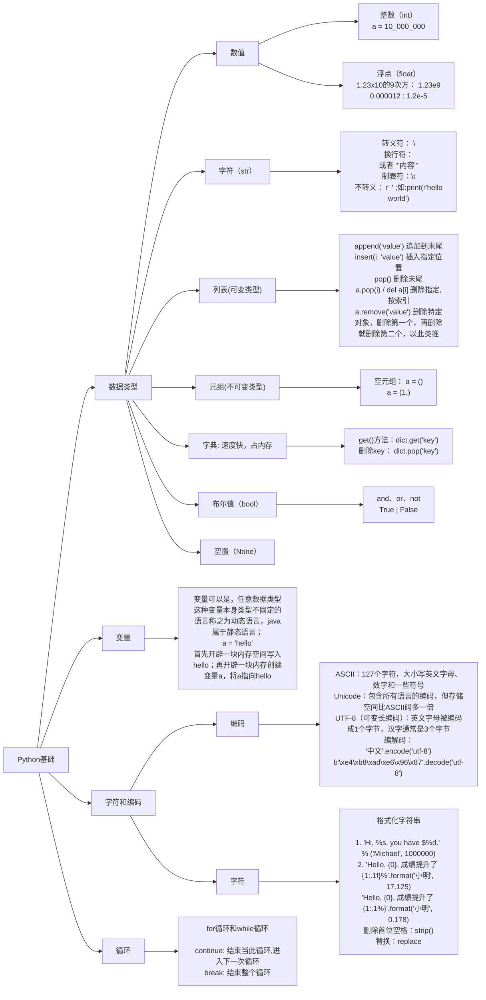
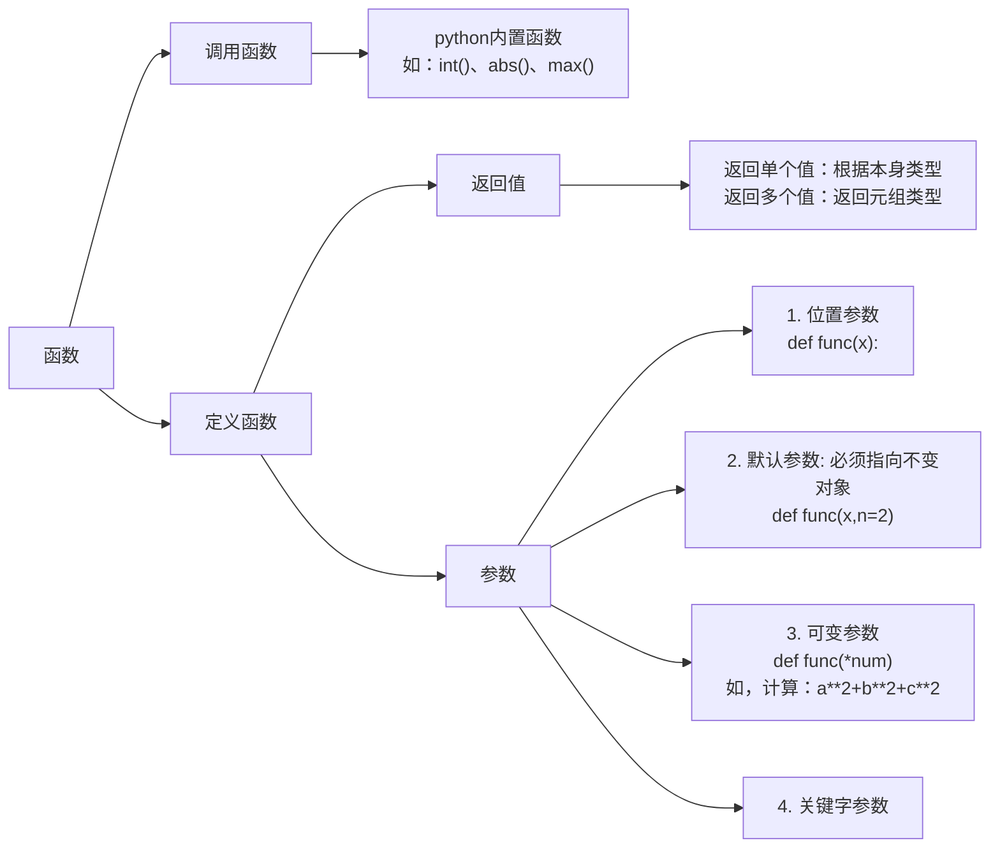
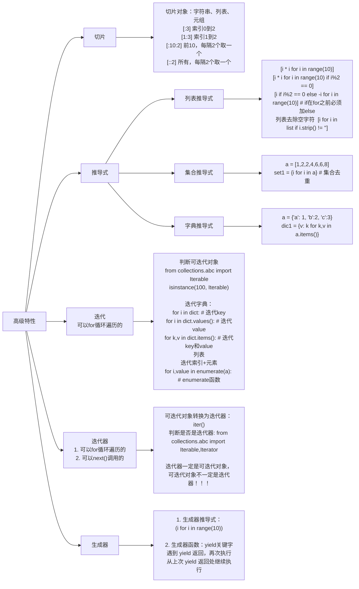
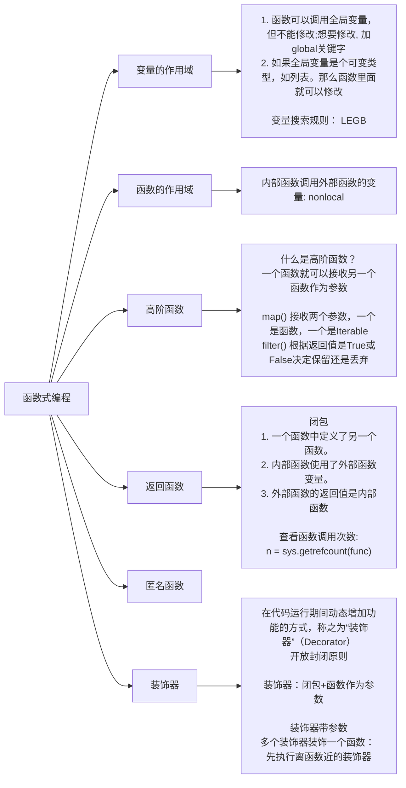
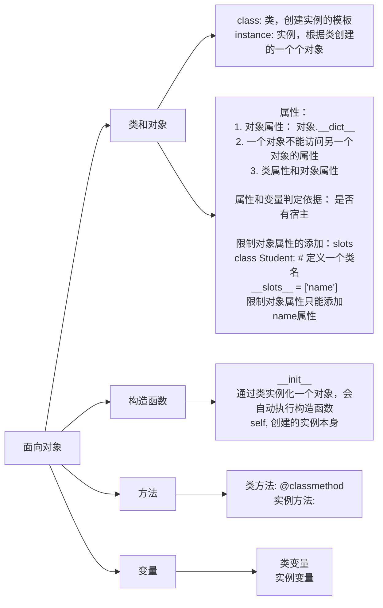
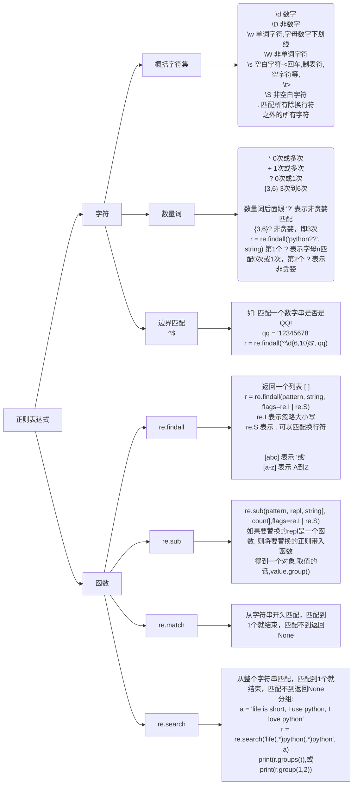
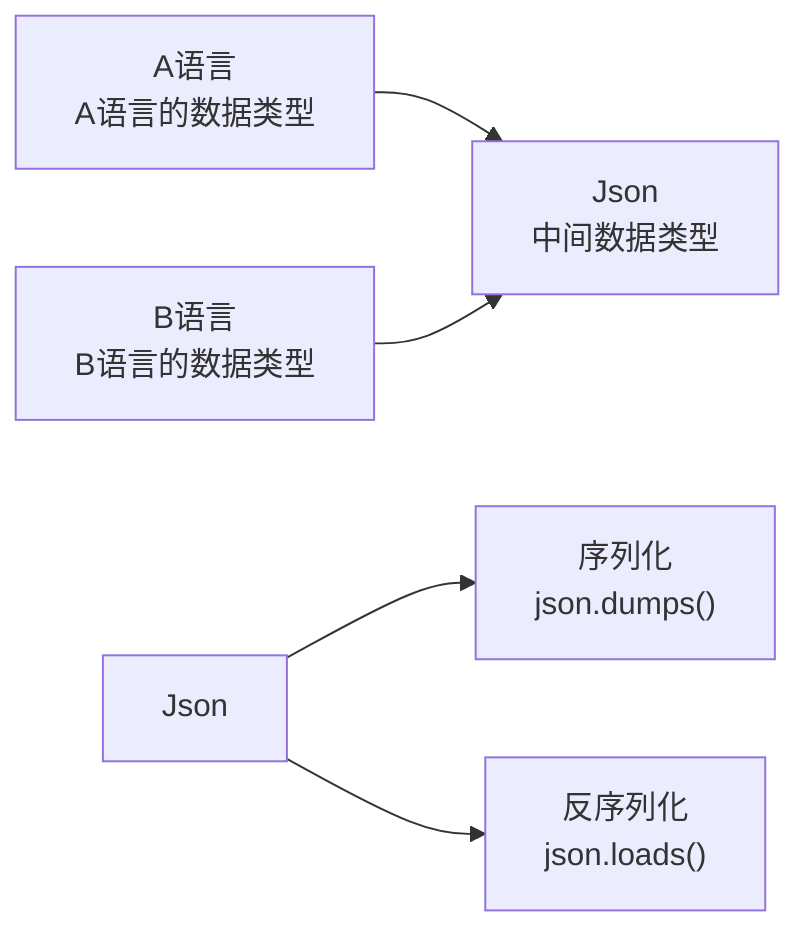

https://github.com/walter201230/Python

## 1.python简介

缺点：

相比C语言运行速度慢，因为python是解释型语言，执行时会翻译成cpu能理解的机器码，这个解释过程耗时。

C语言是直接编译成机器码。

python解释器：cpython，CPython用`>>>`作为提示符。

## 2.安装python

下载地址：https://www.python.org/ftp/python/3.8.10/python-3.8.10-amd64.exe


特别要注意勾上`Add Python 3.8 to PATH`，然后点“Install Now”即可完成安装。

如果在安装时漏掉了勾选`Add Python 3.8 to PATH`，那就要手动把`python.exe`所在的路径添加到Path中。

## 3.pycharm安装

下载社区免费版：

**a安装：**


Create Associations创建关联，勾选.py，以后打开.py文件就会用PyCharm打开。

**b.配置：**

**①：Don't Send（不要发送，不分享数据）**


选择背景颜色：


然后，新建项目就可以敲代码了！


**c.PyCharm修改Interpreter**

file ->setting->project ->project interpreter：


## 4.输入和输出

```python
input() 输入

$ vim hello.py
name=input("请输入内容:")
print(name)
$ python3 hello.py

# input()和print()是在命令行下面最基本的输入和输出，但是，用户也可以通过其他更高级的图形界面完成输入和输出，比如，在网页上的一个文本框输入自己的名字，点击“确定”后在网页上看到输出信息。
```

**如何做一个简单的交互式的输入输出界面？**

用easygui模块

代码如下：

```python
$ vim hello.py
import easygui
name = easygui.enterbox("who are you")
easygui.msgbox(name + "nihao")
```

效果如图：


## 5.python基础

### 1.数据类型和变量

- 数据类型

```python
- 整数： int
    对于很大的数，例如`10000000000`，Python允许在数字中间以`_`分隔，写成`10_000_000_000`和`10000000000`是完全一样的。十六进制数也可以写成`0xa1b2_c3d4`。
-------------------------------------------------------------   
- 浮点数：float
1.23x10的9次方： 1.23e9
0.000012 : 1.2e-5
-------------------------------------------------------------
- 字符串： str
  以单引号'或双引号"括起来的任意文本
  如果文本有'或者",那么通过\转义; 如： 
a = "I'm \"Zhangsan\""  输出结果： I'm "Zhangsan"

\n  :换行符
或者：'''内容'''
a = """hello
python
nihao"""

\t  :制表符
\\  :\
Python还允许用r''表示默认不转义
print(r'''hello,\n
world''')
-------------------------------------------------------------
- 布尔值： bool
True和False
布尔值可以用and、or和not运算。
>>> not 1 > 2
True

if age >= 18:
    print('adult')
else:
    print('teenager')
--------------------------------------------------------------   
- 空值： None
    
```

- 变量

```python
变量可以是任意数据类型。
这种变量本身类型不固定的语言称之为动态语言，java属于静态语言；
如java变量：
int a = 123

理解变量在计算机内存中的表示也非常重要。当我们写：
a = 'ABC'
时，Python解释器干了两件事情：

1.在内存中创建了一个'ABC'的字符串；
2.在内存中创建了一个名为a的变量，并把它指向'ABC'。

思考题：
a = 'ABC'
b = a
a = 'XYZ'
print(b)

猜测打印结果是什么？

```


```python
# 除法和地板除： /和//
>>> 10/3
3.3333333333333335
>>> 10//3   地板除只保留整数
3
>>> 10%3   余数运算
1
```

### 2.字符和编码

计算机只能处理数字，如果要处理文本，就必须先把文本转换为数字才能处理

```python
-  一个字节能表示的最大的整数就是255
. ASCII码只有127个字符： 大小写英文字母、数字和一些符号
. Unicode字符集：包含所有语言的编码，但存储空间比ASCII码多一倍
. “可变长编码”的UTF-8编码： 英文字母被编码成1个字节，汉字通常是3个字节，只有很生僻的字符才会被编码成4-6个字节
```

| 字符 | ASCII    | Unicode           | UTF-8                      |
| ---- | -------- | ----------------- | -------------------------- |
| A    | 01000001 | 00000000 01000001 | 01000001                   |
| 中   | x        | 01001110 00101101 | 11100100 10111000 10101101 |

```python
如果要在网络上传输，或者保存到磁盘上，就需要把str变为以字节为单位的bytes
>>> '中文'.encode('utf-8')
b'\xe4\xb8\xad\xe6\x96\x87'

从网络或磁盘上读取了字节流，那么读到的数据就是bytes。要把bytes变为str，就需要用decode()方法：
>>> b'\xe4\xb8\xad\xe6\x96\x87'.decode('utf-8')
中文

.py文件如下：  告诉Python解释器，按照UTF-8编码读取源代码
#!/usr/bin/env python3
# -*- coding: utf-8 -*-

```

格式化：字符串

```python
%运算符
>>> "hello, %s" % "python"
hello, python

>>> 'Hi, %s, you have $%d.' % ('Michael', 1000000)
Hi, Michael, you have $1000000.

%s表示用字符串替换，%d表示用整数替换.
后面就跟几个变量或者值，顺序要对应好。如果只有一个%?，括号可以省略。

字符串里面的%是一个普通字符怎么办？
用%%来表示一个%;
>>> 'growth rate: %d %%' % 7
'growth rate: 7 %'
-------------------------------------------------------------- 
format()
占位符{0}、{1}……
>>> 'Hello, {0}, 成绩提升了 {1:.1f}%'.format('小明', 17.125)

f-string
r = 2.5
s = 3.14 * r ** 2
a = f"hello, {s:.2f}"
print(a)

--------------------------------------------------------------
删除首尾空格： strip()
a = "   shang hai    "
print(a)
print(a.strip())

删除前面空格： lstrip()
print(a.lstrip())

删除后面空格： rstrip()
print(a.rstrip())
--------------------------------------------------------------
字符串替换： replace
a = "hello,world"
a = a.replace("world", "python")   # 这里必须用变量接收一下，否则无法替换
print(a)

a = "hello,world,world,world"
a = a.replace("world", "python", 1)  # 这里表示只替换第1个
print(a)

打印结果：
hello,python,world,world
```

### 3.列表、元组、字典

```python
- 列表： list
list是一个可变的有序表,里面的元素的数据类型可以不同.

a = ["zhang","wang","li",100]
len(a)     # len函数获取列表的长度
索引从0开始，最后一个元素的索引是len(a) - 1

>>> print(a[-1])
100

append()方法      # 追加到末尾
a.append("zhu")

insert()方法     # 插入指定位置
a.insert(2,"zhao")

pop()方法     # 删除末尾
a.pop()

pop(i) 或del    # i是索引位置
a.pop(2) 或 del a[2]

remove    # 删除特定对象
a = ["hello", "world", "tom", "jerry"]
a.remove("tom")    # 如果有多个"tom"元素，删除第一个，再删除就删除第二个，依此类推

join函数用法：
list=['1','2','3','a','b','c']
print(''.join(list))
运行结果： 123abc

```

```python
- 元组： tuple
不可变有序列表叫元组。

思考：不可变的tuple有什么意义？
因为tuple不可变，所以代码更安全。如果可能，能用tuple代替list就尽量用tuple

a = ("zhang","wang","li")

a = ()   # 空元组
a = (1,)   # 一个元素的元组，注意：不能写成 a = (1),和数学中小括号有歧义


“可变的”tuple：
a = ("zhang","wang",["A","B"])
a[2][0] = "X"
>>> print(a)
('zhang', 'wang', ['X', 'B'])
```

```python
- 字典： dict
key-value存储
查询速度很快，不会随着字典大小的增加而变慢
>>> a = {"name": "tom","age": 21,"gender": "male"}
>>> print(a["name"])

新增：
>>> a["like"] = "read"

key不存在报错问题：
>>> a["test"]   #报错，因为key不存在
# 解决1：
if "test" in a:
    print(a["test"])
else:
    print("no key")
# 解决2：get()方法
>>> print(a.get("test"))  #不存在则返回None

删除key： pop()方法
a.pop("name")

dict的key必须是不可变对象，而list是可变的！

# 和list比较：
1.速度极快
2.需要占用大量的内存
```


### 4.条件判断&循环

```python
if x:
    print('True')
只要x是非零数值、非空字符串、非空list等，就判断为True，否则为False。

s = input('birth: ')
birth = int(s)    # input()返回的数据类型是str，str不能直接和整数比较，所以转换
if birth < 2000:
    print('00前')
else:
    print('00后')
```

循环

```python
sum = 0
for x in [1, 2, 3, 4, 5, 6, 7, 8, 9, 10]:
    sum = sum + x
print(sum)

如果要列出1-100的整数？
- range()函数： 生成整数序列
- list()函数： 转换为list

for i in list(range(101)):    # range方法，从0开始
    print(i)
---------------------------------------------------    
思考1：
sum = 0
n = 99
while n > 0:
    sum = sum + n
    n = n - 2
print(sum)

思考2： break语句用法
n = 1
while n <= 100:
    if n > 10: # 当n = 11时，条件满足，执行break语句
        break # break语句会结束整个循环
    print(n)
    n = n + 1
print('END')

思考2： continue语句用法
n = 0
while n < 10:
    n = n + 1
    if n % 2 == 0:
        continue  # 结束当前循环，进入下一次循环
    print(n)
    
可见，break和continue的区别：
break： 结束整个循环
continue： 结束当次，进入下一次
```

```python
九九乘法表

for i in range(1,10):
    for j in range(1,10):
        if j < i:
            print("{0}x{1}={2} ".format(j,i,i*j),end='')
        if j == i:
            print("{0}x{1}={2} ".format(j,i,i*j))
```

---

### 小结：




## 6.函数

为什么要使用函数？

一次定义，多次调用。

### 1.调用函数

```python
- python内置
https://docs.python.org/3/library/functions.html
如：
abs(x)   # 求绝对值
max()    # 返回最大值
hex()    # 转换十六进制

# 数据类型转换
int()
float()
str()
...
```

### 2.定义函数

```python
- 自定义
写一个求绝对值函数：

$ vim test1.py
def my_abs(x):
    if not isinstance(x,(int,float)):   # 错误处理
        raise TypeError("bad operand type for my_abs") #
    if x >= 0:
        return x
    else:
        return -x
    
$ vim test2.py
from test1 import my_abs   # 从文件test1导入函数模块 ！！！
print(my_abs(-100))

# 空函数
def nop():
    pass

# 返回多个值
一元二次方程求解：
import math
def func(a,b,c):
    key = b**2 - 4*a*c
    if key >= 0:
        x1 = (-b + math.sqrt(key))/2*a
        x2 = (-b - math.sqrt(key))/2*a
        return x1, x2
    else:
        return "方程无解"
        
以元组的形式返回
... 
```

参数

```python
- 位置参数
def power1(x):
    return x**2
print(power1(5))

- 默认参数
def power1(x,n=2):
    return x**n
print(power1(5))   # 不传，默认n=2
print(power1(5,3))  # 
---
默认参数必须指向不变对象!!
def test(L=[]):    # 参数是列表，这样不行的
    L.append("END")
    return L

可以修改如下：
def test(L=None):
    if L is None:
        L = []
    L.append("END")
    return L

- 可变参数

如：计算 a**2+b**2+c**2
... 要定义出这个函数，我们必须确定输入的参数。由于参数个数不确定，我们首先想到可以把a，b，c……作为一个list或tuple传进来,但是调用就得写成： calc([1,2,3]),所以改进如下：

def calc(*numbers):    # numbers接收到的是一个tuple
    sum = 0
    for i in numbers:
        sum = sum + i * i
    return sum
calc(1,2,3)

- 关键字参数

```

---

### 小结：




## 7.高级特性

### 1.切片

```python
a = list(range(11))
a[:3]  # 从索引0，到索引3，不包含3
a[1:3]   # 从索引1 。。

a[:10:2]  # 前10，每隔2个取1个
a[::5]    # 所有，每隔5个取1个

tuple元组也可以切片，字符也可以切片！
如：
a = "abcdefg"
a[:3]
```

### 2.推导式

```python
- 列表推导式
a = [i * i for i in range(10)]
a = [i * i for i in range(10) if i%2 == 0]

if ... else
a = [i if i%2 == 0 else -i for i in range(10)]  # if在for前必须加else
```

```python
- 集合推导式
a = [1,2,2,4,6,6,8]
set1 = {i for i in a}    # 集合去重
```

```python
- 字典推导式
a = {'a': 1, 'b':2, 'c':3}
dic1 = {v: k for k,v in a.items()}
```

### 3.迭代（Iteration）

```python
# 检查对象是否可迭代
from collections.abc import Iterable
>>> isinstance(100, Iterable)

迭代字典：
a = {"a": 1, "b":2, "c":3}
for i in a:   # 默认迭代的是key
    print(i)
    
for i in a.values():   # 迭代value
    print(i) 
    
for k,v in a.items():   # 同时迭代key和value
    print(k,v)
    
list迭代索引+元素
用enumerate函数

a = ['a', 'b', 'c']
for i,value in enumerate(a):
    print(i, value)
```

### 4.生成器

```python
a = (i for i in range(10))
调用
next(a) 或者
a.__next__()

生成器正确使用方法，用for循环
for i in a:
    print(i)
    
生成器函数： yield
def test():
    yield 2
g = test()
# 生成器函数和普通函数执行顺序
普通函数： 顺序执行
生成器函数： 遇到 yield 返回，再次执行从上次 yield 返回处继续执行。

例题： 斐波那契数列
def fib(n):
    a,b = 0,1
    for i in range(n):
        yield b
        a, b = b, a + b
g = fib(10)
for i in g:
    print(i)
    
# 生成器的作用？
多任务切换
```

### 5.迭代器

```python
- 迭代器：
1. 可以for循环
2.可以next()调用

- 生成器： 是迭代器
- 列表、元组，字典，字符串：不是迭代器

# 列表、元组，字典，字符串 转换成 迭代器： iter()
list1 = [1,2]
list1 = iter(list1)   # 迭代器

# 判断是否是迭代器：
from collections import Iterator,Iterable
list1=[1,2]
list1 = iter(list1)
print(isinstance(list1,Iterator))

迭代器一定是可迭代对象，可迭代对象不一定是迭代器！！！
```

---

### 小结：




## 8.函数式编程

### 1.变量的作用域

```python
# 函数可以调用全局变量，但不能修改全局变量; 如：
a = 100
def func():
    print(a)  # 可调用
---
a = 100
def func():
    a += 1      #不可修改，这里会报错
    print(a)
---  
# 但是，如果全局变量是个可变类型，如列表。那么函数里面就可以修改！
b = ["hello"]
def func():
    b.append("world")
func()
print(b)
---
# 通过global实现函数内部修改全局变量
a = 100
def func():
    global a    #现在如果在对变量做任何操作，都会影响全局
    a += 1
    print(a)
    
思考：
a = 100
def func():
    global a
    a = 10
print(a)
解答：因为global a 把a全局化了，所以后边的a = 10 相当于是给全局变量重新赋值
所以，函数外部再打印，结果就是 10 了

# 变量的搜索规则：
LEGB：
- local  #先找本地的
- enclosing  #再找外部函数的
- global     # 再找全局的
- builtIn    # 再找系统变量
如果都没有就报错！
```

### 2.函数的作用域

```python
LEGB
a = 100
def func(b):
    a = 10
    def inner_func(c):
        nonlocal b   # 内部函数调用外部函数的变量，global是调用全局，注意区别！
        c = a + b + c
        b = c   # 如果不加 nonlocal 是不让修改外部函数变量的
        print('a:', a)
        print('b:', b)
        print('c:', c)
    inner_func(8)

func(9)
```

### 3.高阶函数

```python
# 什么叫高阶函数？
一个函数就可以接收另一个函数作为参数
如下： 
def test(x,y,f):   #传入的参数f代表一个函数
    return f(x) + f(y)
a = test(-21,7,abs)
print(a)

# map()函数接收两个参数，一个是函数，一个是Iterable(可迭代对象)
# 将传入的函数依次作用到序列的每个元素，并把结果作为新的Iterator返回

a = map(abs,[1,-2,4,-6,9])  # map这里传入的第一个参数是一个函数
print(list(a))

# reduce
和map函数差不多，但是函数必须接收两个参数。

#reduce把结果继续和序列的下一个元素做累积计算，其效果就是：
reduce(f, [x1, x2, x3, x4]) = f(f(f(x1, x2), x3), x4)

# filter函数
和map差不多，也是接收一个函数，一个序列
会根据返回值是True还是False决定保留还是丢弃！！！

list1 = [1,2,3,4,5,6,7]
def func(x):
    return x % 2 == 1

a = list(filter(func,list1))
print(a)

filter返回的是一个迭代器
a = filter(func,list1)
print(isinstance(a,Iterator))

sorted函数  排序
a = [-2,1,4,6,-3]
b = sorted(a) 或  b = sorted(a, key=abs)
print(b)
```

### 4.返回函数

```python
---------------闭包---------------
- 一个函数中定义了另一个函数
- 内部函数使用外部函数的变量，nonlocal
- 外部函数的返回值是内部函数

def func(a):
    def inner_func(b):
        nonlocal a
        a += 10
        return a + b
    return inner_func

f = func(10)
f1 = f(8)
print(f1)

--------
import sys
def func(a):
    def inner_func(b):
        nonlocal a
        a += 10
        return a + b
    return inner_func

func1 = func

n = sys.getrefcount(func)    # 查看函数调用次数
print(n) 

- 这里统计结果为3次， func函数本身算1次，func1调用算一次，getrefcount统计也要调用，算一次；
所以统计真正调用次数 -1次就行。
```

### 5.匿名函数


### 6.装饰器

```python
# 在代码运行期间动态增加功能的方式，称之为“装饰器”（Decorator）。
遵循开放封闭原则，即：在不改变源代码的前提加增加功能

如，原函数代码
def buy():
    print("buy things")

buy()

我这里想要增加功能，先登录，再买东西，修改如下：
装饰器：闭包+函数作为参数

def func(f):   # 这里的f实际上就是要装饰的函数 buy
    def b():
        print("login in successful!")
        f()
        print("enjoying buy")
    return b

@func
def buy():
    print("buy things")

buy()

-----------------------------------------------------
装饰器带参数
def show():
    print("这是一个函数")

def test(n):
    print("函数的参数:", n)
------    
如果要同时装饰上面两个函数，一个带参数，一个不带参数
def decorator(f):
    def wrapper(*args,**kwargs):
        f(*args,**kwargs)
        print("函数{}调用结束!".format(f.__name__))
    return wrapper

@decorator
def show():
    print("这是一个show函数")

@decorator
def test(n):
    print("函数的参数:", n)

show()
test(100)
-----
*args     元组。如果参数为空，解开元组
**kwargs  字典。如果字典为空，解开字典
f.__name__  系统变量，调用函数的名称
所以，无论被装饰的函数有没有传参，我们都统一写成这种格式！

-----------------------------------------------------
装饰有返回值的
flag = False
def decorator(f):
    def wrapper(*args,**kwargs):
        print("身份验证")
        r = f(*args,**kwargs)
        return r
    return wrapper

def login():
    global flag
    name = input("请输入用户名:")
    password = input("请输入密码:")
    if name == "admin" and password == "123":
        flag = True

login()

@decorator
def islogin():
    if flag:
        return "验证成功"
    else:
        return "验证失败"

a = islogin()
print(a)

---
函数有返回值，在装饰器里面也要返回才行，这两行！
        r = f(*args,**kwargs)
        return r
```

实战案例：

```python
islogin = False

def decorator(func):
    def wrapper(*args,**kwargs):
        if islogin:
            func(*args,**kwargs)
        else:
            print("请先登录账户验证！")
            f = login()
            if f:
                func(*args,**kwargs)
    return wrapper

def login():
    global islogin
    name = input("请输入用户名:")
    password = input("请输入密码:")
    if name == "admin" and password == "123":
        islogin = True
        return islogin
    return islogin

@decorator
def buy_tickt():
    info = {"星光影视城": ("哪吒闹海",["10:30", "13:50", "19:45"])}
    for k,v in info.items():
        print("地址:", k)
        print("电影名:", v[0])
        for i in v[1]:
            print("------>>", i)

buy_tickt()
```

多个装饰器装饰一个函数：

```python
def decorator1(func):
    def wrapper(*args,**kwargs):
        func(*args,**kwargs)
        print("购买家具")
        print("购买生活用品")
    return wrapper

def decorator2(func):
    def wrapper(*args,**kwargs):
        func()
        print("铺地板")
        print("装修")
    return wrapper


@decorator1
@decorator2    #先执行这个装饰器，因为离house函数最近
def house():
    print("-----> 毛坯房")

house()


------
总结： 先执行离函数近的装饰器
```

### 7.偏函数

```python
functools模块提供

a = int('12345')   # 相当于 a = int('12345', base=10)
所以，将16进制数转换为10进制
a = int('12', base=16)

温习进制转换：16进制
2AF5换算成10进制:
第0位：5 * 16的0次方
第1位：F * 16的1次方，F为15
第2位：A * 16的2次方
第3位：2 * 16的3次方
然后，直接相加！

8进制同理

functools.partial 帮助我们创建一个偏函数

import functools
int2 = functools.partial(int, base=16)
a = int2("1234")
print(a)

# 这样我就可以int2("1234") 这样直接转换了，而不需要 int("1234", base=16)

```

---

### 小结：




## 9.面向对象编程

### 1.类和对象

```python
- class: 类
- instance： 实例，根据类创建出来的一个个对象！
好比：学生信息表就是一个类； 而填上学生的具体信息相当于就是对象

第一个面向对象程序：
class Student():
    sum1 = 0
    def print_student(self):
        self.sum1 += 1
        print("学生总数是:", self.sum1)

student = Student()    # 实例化一个对象
student.print_student()

self： 创建的实例本身

---------------------
class Student:
    sum1 = 0
    def print_student(self, name, score):  #实例方法
        self.name = name
        self.score = score
        self.sum1 += 1
        print("{0}, 分数: {1}".format(self.name, self.score))
        print("学生总数:", self.sum1)

student1 = Student()
student1.print_student("tom", 59)
student1.print_student("lucy", 81)
student1.print_student("jerry", 98)

总结： 类是创建实例的模板，而实例则是一个一个具体的对象
```

### 2.构造函数

```python
__init__     实例化对象时，会自动执行构造函数
class Student():
    sum1 = 0
    def __init__(self,name,age):
        self.name = name
        self.age = age
        self.__class__.sum1 += 1   # 调用类变量
        print("学生总数是:", self.__class__.sum1)

student1 = Student("tom", 13)
student2 = Student("bob", 16)
student3 = Student("lucy", 21)

注意上边 self.__class__.sum1 和 self.sum1 的区别！
```

### 3.类方法

```python
class Student:
    sum1 = 0
    @classmethod  #通过这个装饰器来创建一个类方法
    def print_student(cls, name, score):
        cls.name = name
        cls.score = score
        cls.sum1 += 1
        print("{0}, 分数: {1}".format(cls.name, cls.score))
        print("学生总数:", cls.sum1)

student1 = Student()
student1.print_student("tom", 59)  #这里对象调用类方法，但是不建议；还是建议直接用类来调用类方法,如下：
# Student.print_student("tom", 59)

student2 = Student()
student2.print_student("lucy", 81)

student3 = Student()
student3.print_student("jerry", 98)

思考： 注释掉上面的 @classmethod 来看看执行结果有什么不同！！
----------------------------------------------
class Student:
    sum1 = 0
    def __init__(self,name,age):
        self.name = name
        self.age = age

    @classmethod
    def print_student(cls):
        print(cls.sum1)
        print(self.name)   #类方法不能访问实例变量，会报错！

student1 = Student("tom", 18)
```

### 4.成员可见性

```python
class Student:
    def marking(self, score):
        if 0 <= score <= 150:
            self.score = score
            print(self.score)
        else:
            print("分数必须在0-150之间")


student = Student()
student.marking(-23)
------------------------------------

class Student:
    def __marking(self, score):    #方法前面加双下划线代表：私有的方法
        self.score = score
        print(self.score)

student = Student()
student.__marking(89)    # 这里报错; 对象不能调用私有方法

------------------------------------
class Student:
    def __init__(self, name, age):
        self.name = name
        self.__age = age   # 前面双下划线，私有变量

student = Student("tom", 18)
print(student.name)    # 这个正常
print(student.__age)   # 这个报错，对象不能调用私有变量

print(student.__dict__)   # 通过__dict__查看实例的变量名，私有变量python在内部做了改名；实际上python
本身是没有办法限制你去访问私有变量的

print(student._Student__age)   # 通过改变的名也可以调的

```

### 5.面向对象三大特性

```python
- 继承
- 封装
- 多态
```

```python
---------------继承---------------
定义父类： c1.py
$ vim c1.py
class Human:
    sum1 = 1001
    def __init__(self,name,age):
        self.name = name
        self.age = age
        print("这是一个父类构造函数")
    def get_name(self):
        print(self.name)
        print("这是父类实例方法")
        
定义子类： c2.py
$ vim c2.py
from c1 import Human
class Student(Human):
    def do_homework(self):
        print(self.name)

student1 = Student("tom",19)    #初始化传入父类参数
student1.do_homework()
print(student1.name)
student1.get_name()    # 调用父类实例方法
```

```python
但是上面的调用是没有意义的，子类应该有自己的参数

from c1 import Human
class Student(Human):
    def __init__(self,name,age,school):
        Human.__init__(self,name,age)   # 类可以调用实例方法，但不合理，还有这里需要传入self
        self.school = school
        print("这是一个子类构造函数")

    def do_homework(self):
        print(self.name)

student1 = Student("tom",19,"人民小学")
student1.do_homework()
student1.get_name()

为什么上面 Human调用__init__ 方法需要传入self呢？ 像student1对象调用do_homework方法都可以不传self。

回答： 实例化一个类的时候，python内部执行构造函数会自动传入self；类直接调用实例方法是需要手动传入self
如： Student.do_homework()  也会报错，正确方式：
student1 = Student("tom", 19, "人民小学")   # 实例化一个对象
student1.do_homework()
```

```python
上边Human.__init__ 的方式调用是不好的，如果继承的父类修改，那所有的调用都得修改
正确的调用如下：
super(Student,self).__init__(name,age)
```

```python
# 调用父类方法
from hello import Human
class Student(Human):
    def __init__(self,name,age,school):
        # Human.__init__(self,name,age)
        super(Student,self).__init__(name,age)
        self.school = school
        print("这是一个子类构造函数")

    def do_homework(self):
        super(Student,self).get_name()    # 调用父类方法
        print(self.name)

student1 = Student("tom",19,"人民小学")
student1.do_homework()
```

### 小结:




## 10.正则表达式

```python
a = 'c|python|c#|php'
a.index("python")>-1
"python" in a

"python": 普通字符
\d:  元字符

import re
a = 'c|python|c#|12php89'
r = re.findall("python",a)
r1 = re.findall("\d",a)
print(r)
print(r1)
```

```python
import re
s = "abc,acc,adc,aec,afc,ahc"
r = re.findall("a[cf]c",s)    # 普通字符用来定界，中间[cf]表示c或者f  
print(r)

如果改为： r = re.findall("a[^cf]c",s)    # "^" 取反
如果改为： r = re.findall("a[c-f]c",s)    # 表示c到f
```

### 1. 概括字符集

```python
概括字符集：
\d 数字  \D 非数字
\w 单词字符（字母数字下划线）  \W 非单词字符
\s 空白字符(回车，制表符，空字符等，\n \t " ")    \S 非空白字符
.  匹配所有除换行符\n之外的所有字符

import re
a = "python 111java8397php"
r = re.findall("\w",a)
print(r)
```

### 2.数量词

```python
数量词：
*  0次或多次
+  1次或多次
?  0次或1次

import re
a = "python 111java8397php"
r = re.findall("[a-z]{3,6}",a)   # 3-6区间，贪婪匹配
print(r)

r = re.findall("[a-z]{3,6}?",a)   # 加?表示非贪婪（数量词后面的?表示非贪婪）
-----------
import re
a = "pytho111python839pythonn89"
r = re.findall("python*",a)    # *，代表n出现0次或多次
print(r)
['pytho', 'python', 'pythonn']  # 打印结果
-----
import re
a = "pytho111python839pythonn89"
r = re.findall("python?",a)    # ?，代表n出现0次到1次
print(r)


# 思考？
import re
a = "pytho111python839pythonn89"
r = re.findall("python??",a)    
print(r)

- 上面正则出现的两个?分别代表什么意思。
第一个?代表n匹配0次到1次；第二个?表示非贪婪，0次到1次的非贪婪就是0次。所以打印结果为：
['pytho', 'pytho', 'pytho']
```

### 3.边界匹配

```python
例： 匹配一个合法的qq号码
首先正确的qq号码长度是5-10位

import re
qq = '12345678900'   # 这里是11位
r = re.findall("\d{6,10}", qq)
print(r)

结果位： ['1234567890']

很明显这不是我们想要的，我们是要匹配整个字符串是否符合正则规则，而不是包含
改写成：
r = re.findall("^\d{6,10}$", qq)
```

### 4.组

```python
() 代表组

import re
a = "PythonPythonPythonPython"
r = re.findall('(Python){3}', a)   # Python匹配3次
print(r)

上面正则不能写成
r = re.findall('Python{3}', a)   # 这个是代表n匹配3次，而不是Python整个字符串
```

### 5.匹配模式参数

```python
import re
a = "Python12C#456Java789PHP"
r = re.findall('c#', a, flags=re.I)
print(r)

- 匹配模式re.I表示忽略大小写；上面例子，如果不加flags=re.I ，那么就匹配不到c#


import re
a = "Python12C#\n456Java789PHP"
r = re.findall('c#.{1}', a, flags=re.I)
print(r)

- 上面.表示除换行符之外的所有字符，所以.{1}匹配不到\n, 要想匹配到\n。增加re.S匹配模式。
import re
a = "Python12C#\n456Java789PHP"
r = re.findall('c#.{1}', a, flags=re.I | re.S)  # 这里的 | 代表同时支持两种匹配模式，不是或的关系
print(r)

# 打印结果：
['C#\n']
```

### 6.替换

```python
re.sub 

import re
a = "Python12C#456Java7C#89PHP11C#"
r = re.sub('c#', "GO", a, flags = re.I)
print(r)

- 将C#替换成GO
- 默认替换所有的C#为GO


如果只想替换第1个怎么办呢？
r = re.sub('c#', "GO", a, 1, flags = re.I)
- 这里的1表示只替换第1个，2代表第2个，以此类推...

-----------------------
替换成函数：
import re

def func(value):
    pass
a = "Python12C#456Java7C#89PHP11C#"
r = re.sub('c#', func, a, flags = re.I)
print(r)

打印结果：
Python12456Java789PHP11
- C#消失了，因为这里func函数什么都没做

---
import re

def func(value):
    print(value)
a = "Python12C#456Java7C#89PHP11C#"
r = re.sub('c#', func, a, flags = re.I)

- 执行结果：
<re.Match object; span=(8, 10), match='C#'>
<re.Match object; span=(18, 20), match='C#'>
<re.Match object; span=(27, 29), match='C#'>

# 想要取值，加上value.group(),如下：
import re

def func(value):
    value = value.group()
    print(value)
a = "Python12C#456Java7C#89PHP11C#"
r = re.sub('c#', func, a, flags = re.I)

- 执行结果：
C#
C#
C#

所以，如果要替换'C#'为 '!!C#!!'
改写函数：
import re

def func(value):
    value = value.group()
    return "!!" + value + "!!"
a = "Python12C#456Java7C#89PHP11C#"
r = re.sub('c#', func, a, flags = re.I)
print(r)

执行结果：
Python12!!C#!!456Java7!!C#!!89PHP11!!C#!!

-------------------
替换函数实例：
import re
a = "A23B987CDE06F"
# 将字符串中数字大于等于6的替换为9，小于6的替换为0
def func(value):
    value = value.group()
    if int(value) >=6:   #因为value是字符，所以要转换为int类型比较
        return "9"
    else:
        return "0"

r = re.sub('\d', func, a)
print(r)
```

### 7.match和search

```python
# match
import re
a = "23B987CDE06F"
r = re.match('\d', a)   # match函数从字符串开头匹配，匹配到1个就结束，匹配不到返回None
print(r.group())

# search
import re
a = "A23B987CDE06F"
r = re.search('\d', a)  # search函数从整个字符串匹配，匹配到1个就结束，匹配不到返回None
print(r.group())

# 分组
import re
a = "life is short, I use python, I love python"
r = re.search("life(.*)python(.*)python", a)
print(r.group())  #默认返回整个匹配到的字符串
print(r.group(1))  # 返回第1个分组
print(r.group(2))
print(r.group(1,2))  # 返回一个元组
print(r.groups())    # 同上，返回一个元组

# findall也能实现
r = re.findall("life(.*)python(.*)python", a)
print(r)

```


### 小结：




## 11.JSON

什么是json？

- 轻量级的数据交换格式

```json
json可以用于跨语言交换数据

- json字符串
json_str = '{"name": "lucy", "age": 18}'    # 正确
json_str = "{'name': 'lucy', 'age': 18}"    # 错误，json字符串里面必须用双引号，不能用单引号

```

```python
反序列化： 将字符串->语言下面的某种数据结构
import json
json_str = '{"name": "lucy", "age": 18}'
a = json.loads(json_str)
print(a)


数组，array
import json
json_str = '[{"name": "lucy", "age": 18}, {"score": 89, "gender": "female", "flags": false}]'
a = json.loads(json_str)
print(type(a))
执行结果：
<class 'list'>
[{'name': 'lucy', 'age': 18}, {'score': 89, 'gender': 'female', 'flags': False}]
可以看到，python里把小写的false变成了大写的False。
```

```python
序列化
import json
a = [
      {"name": "lucy", "age": 18},
      {"score": 89, "gender": "female", "flags": False}
    ]
json_str = json.dumps(a)
print(type(json_str))
print(json_str)
```

json和python数据对应关系

| json   | python      |
| ------ | ----------- |
| object | dict        |
| array  | list        |
| string | str         |
| number | int / float |
| true   | True        |
| false  | False       |
| null   | None        |

### 小结：




## 12.IO编程

### 1.文件读写

i.`进入目录`

```python
os.chdir('D:/source/dataset')  #进入目录
os.listdir()   #列出目录下文件，返回一个列表[]
```

ii.`读文件`

```python
f = open("D:\\ronnie\\111.txt", 'r')   # 标识符'r'表示读
a = f.read()
print(a)
f.close()   # 文件使用完毕后必须关闭，因为文件对象会占用操作系统的资源,并且操作系统能打开的文件数量是有限的
```

Python引入了`with`语句来自动帮我们调用`close()`方法：

```python
with open('/path/to/file', 'r') as f:
    print(f.read())
```


```python
# 调用read()会一次性读取文件的全部内容，如果文件有10G，内存就爆了
- 保险起见，可以反复调用read(size)方法，每次最多读取size个字节的内容；
- 调用readline()可以每次读取一行内容

f = open("D:\\ronnie\\111.txt", 'r')
print(f.readline().strip())   # 去除\n
print(f.readline().strip())
print(f.readline().strip())
f.close()

f = open("D:\\ronnie\\111.txt", 'r')
print(f.readlines())  # readlines()一次读取所有内容并按行返回list
f.close()
执行结果：
['hello;im 111\n', '222\n', '333\n', '4444\n', '5555']

二进制文件
要读取二进制文件，比如图片、视频等等，用'rb'模式打开文件即可:
>>> f = open('/Users/michael/test.jpg', 'rb')
>>> f.read()
b'\xff\xd8\xff\xe1\x00\x18Exif\x00\x00...' # 十六进制表示的字节
```

iii.`写文件`

```python
with open("D:\\ronnie\\111.txt", 'w') as f:
    f.write("hello\nworld\npython")
    
以'w'模式写入文件时，如果文件已存在，会直接覆盖（相当于删掉后新写入一个文件）。如果我们希望追加到文件末尾怎么办？
- 'a'以追加（append）模式写入

with open("D:\\ronnie\\111.txt", 'a') as f:
    f.write("\n123\n456")
```

## 13.常用第三方模块

获取系统信息模块： psutil

```python
import psutil

print(psutil.cpu_count())        # 获取cpu逻辑核心数
print(psutil.cpu_count(logical=False))
print(psutil.virtual_memory())   # 获取内存使用情况

print(psutil.disk_usage('C:\\'))   # 磁盘使用情况
print(psutil.disk_partitions())    # 磁盘分区
```

```python
#######内存#########

import psutil

mem = psutil.virtual_memory()
memtotal = mem.total/1024/1024
memused = mem.used/1024/1024
membaifen = mem.used/mem.total*100


print("总内存: {0:.2f}MB".format(memtotal))
print("已使用内存: {0:.2f}MB".format(memused))
print("内存使用率: {0:.2f}%".format(membaifen))
```


## 14. 脚本

### 1.USDT兑换人民币汇率

```python
import requests
import re

token = "5867589202:AAHm1h64Ho49dCfpQxkQn2Spl0Qd9VCtsh0"
chat_id = "-880684039"

def get_messages():
    url = "https://coinmarketcap.com/zh/currencies/tether/"
    html = requests.get(url).content   # 获取网页内容，类型为bytes
    html = str(html, "utf-8")     # 将bytes类型转换为字符串类型
    r = re.findall('<div class="priceValue "><span>¥(.*?)</span></div>', html)  # ?表示非贪婪匹配
    r = ''.join(r)
    messages = "当前USDT兑人民币实时汇率为:  {}".format(r)
    return messages

def sendtelegram(messages):
    url = "https://api.telegram.org/bot{}/sendMessage?chat_id={}&text={}".format(token, chat_id, str(messages))
    requests.get(url)

if __name__ == "__main__":
    messages = get_messages()
    sendtelegram(messages)
```


### 2.合并excel表

```python
# 合并excel表，xlsx表格

import pandas as pd
from pathlib import Path
files = Path("D:\\tables").glob("*.xlsx")
dfs = [pd.read_excel(f) for f in files]
df = pd.concat(dfs)
df.to_excel("D:\\tables\\111.xlsx",index = False)

-  将D:\tables目录下的所有.xlsx表全部合并成一个新的表111.xlsx
```

```shell
# 解压并合并表格，csv表格
import os
import zipfile
import glob
import pandas as pd

#### 解压 D:\tables 下面所有的zip文件 ####
path = "D:\\tables\\"
L = []

for root,dirs,files in os.walk(path):
    for file in files:
        L.append(file)

for i in L:
    f = zipfile.ZipFile(path+i, "r")
    for file in f.namelist():
        f.extract(file, "D:\\tables")
    f.close()

#### 将目录下的 csv 表格合并为一张表格 #####
os.chdir(path)
extension = 'csv'
all_filenames = [i for i in glob.glob('*.{}'.format(extension))]

#在列表中合并所有文件
combined_csv = pd.concat([pd.read_csv(f) for f in all_filenames ])
#导出 csv
combined_csv.to_csv( "combined_csv.csv", index=False, encoding='utf-8-sig')
```


### 3.写一个python调用接口


**`i.GET请求`**

```python
# GET请求

from flask import Flask,request
import json

app = Flask(__name__)

@app.route("/test100", methods=["GET"])

def check():
    return_dict = {'return_code': '200', 'return_info': '处理成功', 'result': False}

    if not request.args:
        return_dict['return_code'] = '5004'
        return_dict['return_info'] = '请求参数为空'
        return json.dumps(return_dict, ensure_ascii=False)     # 序列化为字符串

    get_data = request.args
    name = get_data.get('name')
    age = get_data.get('age')

    return_dict['result'] = tt(name,age)


    return json.dumps(return_dict, ensure_ascii=False)

def tt(name, age):
    result_str = "%s今年%s岁" % (name, age)
    return result_str

if __name__ == "__main__":
    app.run(debug=False, host='0.0.0.0', port=5000)
    
    
> python xxx.py run     # 运行python程序
```


**postman请求测试**

参数为空时执行结果：


加参数执行结果：


**`ii.POST请求`**

```python
# POST请求

from flask import Flask, request
import json

app = Flask(__name__)

@app.route("/test100", methods=["POST"])

def check():
    return_dict = {'return_code': '200', 'return_info': '处理成功', 'result': False}

    if not request.get_data():
        return_dict['return_code'] = '5004'
        return_dict['return_info'] = '请求参数为空'
        return json.dumps(return_dict, ensure_ascii=False)

    get_data = request.get_data()
    get_data = json.loads(get_data)
    name = get_data.get('name')
    age = get_data.get('age')

    return_dict['result'] = tt(name,age)


    return json.dumps(return_dict, ensure_ascii=False)

def tt(name, age):
    result_str = "%s今年%s岁" % (name, age)
    return result_str

if __name__ == "__main__":
    app.run(debug=False, host='0.0.0.0', port=5000)
```


**postman请求测试：**


**实战post请求**

```python
from flask import Flask, request
import json
import requests

app = Flask(__name__)

@app.route("/test100", methods=["POST"])

def check():
    message = request.get_data()
    message = message.decode("utf-8")    # bytes转为utf-8

    message = json.loads(message)        # 反序列化为字典
    domain = message.get("域名")
    status = message.get("状态")

    message = """============
    域名: {}
    状态: {}
    """.format(domain, status)

    sendtelegram(message)

def sendtelegram(message):
    url = "https://api.telegram.org/bot5429948026:AAFtWaW1ZcU4IUNaNNtIFfK9qHIYoMjAlgg/sendMessage?chat_id=-613903645&text=" + str(message)
    requests.get(url)

if __name__ == "__main__":
    app.run(debug=False, host='0.0.0.0', port=5000)
```

请求


telegram告警信息：


## 15.爬虫

### 1.爬虫脚本

```python
import requests
url = "https://img.win3000.com/m00/b8/b0/4e09d5101850a3f84d019da9d53e9e6a.jpg"
html = requests.get(url).content   # 类型为bytes类型
with open("D:\picture\\1.jpg", "wb") as f:
    f.write(html)
```

```python
# Adult picture 
import requests
import os
import re
def show():
    url = "https://sexynakedgirls.xxx/"
    html = requests.get(url).content    # 获取网页内容(bytes类型)
    html = str(html, "utf-8")    # 将二进制bytes类型转换为str类型，方便正则匹配
    r = re.findall('<a style="padding-bottom.*?href="(.*?)"', html)  # 匹配分组()里的内容，以列表方式返回
    return r

def choose():   #获取图片类型链接
    a = show()
    for i,value in enumerate(a):  # 获取列表的索引和值
        print(i+1, value)
    b = int(input("请选择您要下载的类型编号："))
    url = "https://sexynakedgirls.xxx" + a[b-1]
    return url

def download():
    url = choose()
    html = requests.get(url).content
    html = str(html, "utf-8")
    res = re.findall('<a style="padding-bottom.*?(https:.*?)"', html)
    for i, url in enumerate(res):
        os.mkdir("D:\picture\\" + str(i+1))   # 创建目录
        html = requests.get(url).content
        html = str(html, "utf-8")
        r = re.findall('<a class="item" data-w=.*?href="(.*?)"', html)
        for j, value in enumerate(r):
            html = requests.get(value).content   
            with open("D:\picture\\" + str(i+1) + "\\" + str(j + 1) + ".jpg", "wb") as f:  # with方法会自动调用 close(),注意二进制写入要用‘wb’
                f.write(html)


if __name__ == "__main__":
    download()
```

---


爬取信息并存入excel表：

```python
import requests
import re
import openpyxl   # excel处理模块

def main():
    url = "https://yuehui.163.com/"
    html = requests.get(url).content
    html = str(html, "utf-8")
    name = re.findall('"_blank" class="nick">(.*?)</a>', html)
    name = [i.replace("\u2006", " ").strip() for i in name]   # 将\u2006替换为空
    all = re.findall('<p class="info">(.*?)</p>', html)
    age = [i.split("\u3000")[0] for i in all]     # 字符串切分，以‘\u3000’作为切分，返回列表，然后再取值0号索引的值
    address = [i.split("\u3000")[1] for i in all]
    job = [i.split("\u3000")[2] for i in all]

    wb = openpyxl.Workbook()   # 打开文件
    sheet1 = wb.active   # 创建表
    sheet1.append(['姓名', '年龄', '地址', '工作'])   # 往表里插入数据，按行
    for i, value in enumerate(name):
        sheet1.append([name[i], age[i], address[i], job[i]])   # 循环插入数据

    wb.save('test103.xlsx')    # 保存为文件

if __name__ == "__main__":
    main()
```

### 2.反爬

很多时候通过`requests`请求网页内容的过程中得到不正确的状态码，比如今天我在爬取豆瓣读书评论的过程中，`import requests` 之后，通过`get`获取网页内容，但是返回内容为空。


```python
import requests
url = "https://www.douban.com/"
html = requests.get(url)
print(html.status_code)

# 结果返回状态码为418
```


添加`headers`，模拟浏览器访问

```python
import requests

headers={
        'User-Agent' : 'Mozilla/5.0 (Windows NT 10.0; Win64; x64) AppleWebKit/537.36 (KHTML, like Gecko) Chrome/108.0.0.0 Safari/537.36'
    }
url = "https://www.douban.com/"
html = requests.get(url, headers=headers)
print(html.status_code)

# 此时返回状态为200，搞定！
```

### 3.scrapy框架

#### 1.安装scrapy框架

`i.安装wheel`

```
> pip install wheel
```


`ii.安装Lxml`

[下载Lxml](https://www.lfd.uci.edu/~gohlke/pythonlibs/#lxml)，cp37对应py3.7

```shell
> pip install C:\路径\lxml-4.8.0-cp37-cp37m-win_amd64.whl
下载twisted
```


`iii.安装twisted`

```
> pip install twisted
```


`iv.下载Pywin32 --一定要下对应python版本`

[下载Pywin32](https://sourceforge.net/projects/pywin32/files/pywin32/Build%20221/)

安装，无脑下一步


`v.最后，安装scrapy`

```
> pip install scrapy
```


第一个scrapy爬虫程序：

```python
import scrapy


class QuotesSpider(scrapy.Spider):
    name = 'quotes'
    start_urls = [
        'https://quotes.toscrape.com/tag/humor/',
    ]

    def parse(self, response):    # response为爬取网站得到的html页面
        for quote in response.xpath('//div[@class="quote"]'):
        # for quote in response.css('div.quote'):
            yield {
                'author': quote.css('span small.author::text').get(),
                # 'author': quote.xpath('span/small/text()').get(),
                'text': quote.css('span.text::text').get(),
            }
```

`运行：`

```shell
 > scrapy runspider c2.py -o quotes100.jsonl  #保存到quotes100.jsonl文件
```

---


#### 2.第一个爬虫项目

- 在新建项目之前，需要修改 `settings.py` 文件，否则根据爬虫协议，很多网站不能爬

```shell
打开文件 ..\project01\project01\settings.py

# Obey robots.txt rules
ROBOTSTXT_OBEY = False       # 修改为False，默认为True
```


`i.新建项目`

```shell
> scrapy startproject project01          # project01为项目名
```


`ii.创建爬虫，指定爬取域的范围`

```shell
> cd project01
> scrapy genspider itcast "itcast.cn"    # itcast为爬虫名
```


`iii.编辑代码`

打开文件 `..\project01\project01\spiders\itcast.py` ,编辑

```python
import scrapy


class ItcastSpider(scrapy.Spider):
    name = 'itcast'
    allowed_domains = ['itcast.cn']
    start_urls = ['http://www.itcast.cn/channel/teacher.shtml']     #修改为要爬取的链接

    def parse(self, response):
        filename = "teacher.html"
        with open(filename, "wb") as f:
            f.write(response.body)
```


`iv.启动爬虫`

```shell
> scrapy crawl itcast   # itcast为爬虫名

# 会生成一个teacher.html的文件，保存了爬取的网页内容源代码
```

#### 3.xpath的用法

在 Scrapy 框架中，有两种解析 HTML 源码的函数，分别是 css 和 xpath

xpath用法：

- `/li/a/@herf` 这样取的应该是`href`的内容

- `/li/a/text()` 这样取得是`text`内容


**构造选择器：**

```shell
终端：
> scrapy shell https://movie.douban.com/chart

载入后你将获得一个response的shell变量

>>> response.xpath()
>>> response.css()

# 为了提取真实的原文数据，你需要调用 .extract()方法
>>> response.xpath('//title/text()').extract()

# 如果想要提取到第一个匹配到的元素, 必须调用 .extract_first()
>>> response.xpath('//div[@id="images"]/a/text()').extract_first()
```


#### 4.爬取图片网站示例


```shell
> scrapy startproject picSpider    # 新建项目
> cd picSpider
> scrapy genspider hotgirl "hotnakedgirls.xxx"   # 新建爬虫 

- 修改settings.py
ROBOTSTXT_OBEY = False    # 君子协定
```

编写爬虫代码

```python
import scrapy
import re
import os
import requests

class HotgirlSpider(scrapy.Spider):
    name = 'hotgirl'
    allowed_domains = ['hotnakedgirls.xxx']
    start_urls = ['http://hotnakedgirls.xxx/']
    num1 = 1

    def parse(self, response):
        clicks = response.xpath("//div[@class='inneromelo thumb']/a/@href").extract()

        for index,click in enumerate(clicks):
            print(index+1, click)
        num = int(input("请输入图片类型:"))
        click = "http://hotnakedgirls.xxx" + clicks[num-1]  #获取到主链接地址


            # scrapy爬取到一个页面得到链接后再爬取该链接的页面
        yield scrapy.Request(url=click, callback=self.parse_detail, dont_filter=True)

            # dont_filter=True, 这个参数: scrapy.Request不进入回调函数解决办法

    # 再写一个函数
    def parse_detail(self, response):
        sub_clicks = response.xpath("//div[@class='inneromelo thumb']/a/@href").extract()
        for sub_click in sub_clicks:
            res = re.findall('https:.*', sub_click)   # 获取到子链接地址
            res = res[0]

            yield scrapy.Request(url=res, callback=self.parse_detail1, dont_filter=True)

    def parse_detail1(self, response):

        img_urls = response.xpath("//div[@class='gallery-holder js-album']/a/@href").extract()
        os.mkdir("D:\picture\\" + str(self.__class__.num1))

        for index, img_url in enumerate(img_urls):
            html = requests.get(img_url).content
            with open("D:\picture\\" + str(self.__class__.num1) + "\\" + str(index+1) + ".jpg", "wb") as f:
                f.write(html)

        self.__class__.num1 += 1
```

启动爬虫

```shell
> scrapy crawl hotgirl    # 启动爬虫，爬虫名为hotgirl
```


#### 5.爬取豆瓣（需要添加hearders）

```shell
> scrapy startproject project1    # 创建项目
> cd project1                      
> scrapy genspider douban "douban.com"   # 创建爬虫

settings.py 修改君子协定
```


添加headers

```python
打开settings.py，对整个爬虫生效

USER_AGENT = 'Mozilla/5.0 (Windows NT 10.0; Win64; x64) AppleWebKit/537.36 (KHTML, like Gecko) Chrome/108.0.0.0 Safari/537.36'
```


编写代码： douban.py

```python
import scrapy
import re


class DoubanSpider(scrapy.Spider):
    name = 'douban'
    allowed_domains = ['douban.com']
    start_urls = ['https://movie.douban.com/chart']

    # custom_settings = {
    #     "User_Agent": "Mozilla/5.0 (Windows NT 10.0; Win64; x64) AppleWebKit/537.36 (KHTML, like Gecko) Chrome/108.0.0.0 Safari/537.36",
    # }

    def parse(self, response):
        clicks = response.xpath("//div[@class='indent']/div/table/tr/td/div/a/text()").extract()
        clicks = [i for i in clicks if i.strip() != ""]      # 去除列表空字符
        for movie_name in clicks:
            movie_name = re.search("\S+", movie_name)
            print(movie_name.group())
```


